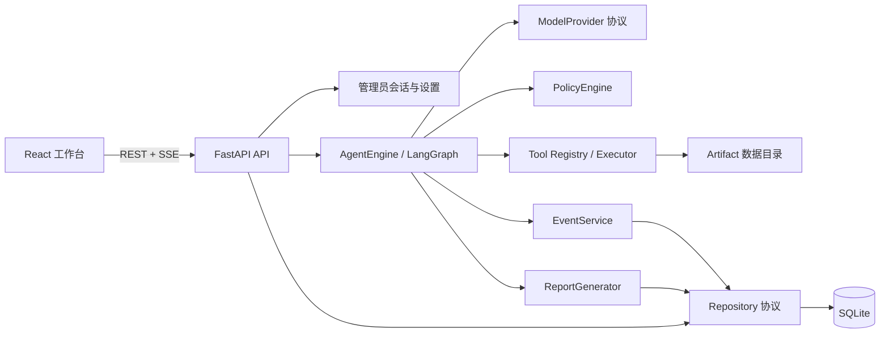

# 御网智元 v0.4.1

御网智元是一个面向网络安全学习、授权测试和可审计自动化场景的对话式 Agent 工作台。它提供接近 Codex 的任务体验：在一个持续对话中配置 Agent、发送任务、上传安全文本附件、实时观察计划和工具事件、停止或重试运行，并下载完整报告。

项目强调四件事：

- **可理解**：前端展示公开的决策摘要、计划变化、工具结果和失败原因，不展示模型隐藏思维链。
- **可审计**：模型调用、工具调用、策略检查、证据、预算、检查点和报告均有持久化记录。
- **可恢复**：Thread、Run、Event、记忆和报告保存在 SQLite；页面刷新、SSE 重连和服务重启不会丢失已完成历史。
- **默认安全**：只允许调用显式注册并通过策略检查的工具，不提供任意 Shell、漏洞利用或默认公网扫描能力。

> 当前生产路径需要配置一个真实且连接测试成功的 Provider。没有 API Key 时仍可启动系统、浏览界面并完成基础设置，但不能发起真实 Agent 运行。测试目录中的 OpenAI 兼容协议服务仅用于自动化契约验证，不会进入生产镜像。

## 目录

- [适用场景](#适用场景)
- [核心能力](#核心能力)
- [系统架构](#系统架构)
- [快速启动](#快速启动)
- [首次配置](#首次配置)
- [完成第一个任务](#完成第一个任务)
- [Provider 与 Agent 配置](#provider-与-agent-配置)
- [运行、审计与报告](#运行审计与报告)
- [配置项](#配置项)
- [项目结构](#项目结构)
- [本地开发](#本地开发)
- [测试与质量门禁](#测试与质量门禁)
- [部署、备份与升级](#部署备份与升级)
- [常用 API 与运维命令](#常用-api-与运维命令)
- [故障排查](#故障排查)
- [安全边界](#安全边界)
- [文档导航](#文档导航)

## 适用场景

御网智元适合：

- 搭建可自托管、可继续扩展的对话式 Agent 工作台。
- 研究 LangGraph 状态机、检查点、SSE 事件续传和人机补充流程。
- 接入 DeepSeek、阿里云百炼/千问、智谱 GLM 或其他 OpenAI 兼容服务。
- 在明确授权范围内开发和验证受控安全工具。
- 对模型决策、工具调用、证据和成本进行可复现审计。

御网智元当前**不是**：

- 公网多租户 SaaS、复杂 RBAC 或企业身份平台。
- 完整 CTF 工具库、漏洞利用框架或任意命令执行器。
- 自动化公网扫描器。
- 多 Agent 集群、RAG 知识库或分布式任务平台。

## 核心能力

| 领域 | 当前能力 |
| --- | --- |
| 对话工作台 | Thread 列表、连续多轮消息、运行状态、附件、停止、重试、刷新恢复 |
| Agent 运行 | LangGraph 显式状态流、规划/直接/混合策略、预算控制、重规划、人工补充 |
| AgentProfile | 配置版本化、默认配置、复制、比较、导入导出、回滚、不可变 Run 快照 |
| Provider | OpenAI 兼容协议、国内厂商预设、结构化输出协商、真实连接测试、fallback |
| 上下文与记忆 | 对话窗口、Thread 摘要、运行摘要、重要事实、安全文本附件、预算裁剪 |
| 完成验证 | 建议回答、JSON Schema 结构化验证、外部证据确定性验证 |
| 实时事件 | REST + SSE、严格递增序号、`Last-Event-ID` 断线续传、持久化时间线 |
| 审计与报告 | 模型/工具/策略/证据/检查点审计，Markdown 与 JSON 报告 |
| 数据 | SQLite、Artifact 安全引用、迁移、备份、恢复 |
| 安全 | 管理员会话、CSRF、Provider Key 加密、日志脱敏、默认拒绝策略、容器最小权限 |
| 工程质量 | pytest、Ruff、mypy、Vitest、ESLint、TypeScript、Playwright、Docker、GitHub Actions |

## 系统架构

项目采用模块化单体架构。核心领域和 Agent 运行层不依赖 FastAPI、SQLite 具体实现、厂商 SDK 或具体工具实现，外层在启动时完成注入。



典型运行链路：

```text
用户消息
  → 固化 TaskSpec、AgentProfile 和 Provider 快照
  → 构建受预算约束的上下文
  → 规划或直接选择结构化动作
  → 策略检查
  → 调用已注册工具
  → 观察与验证
  → 必要时重规划或等待人工补充
  → 生成报告并保存审计
```

## 快速启动

### 环境要求

- 所有方式：Git，建议至少 2 GB 可用内存。
- Docker 方式（推荐给首次使用者）：Docker Desktop，或 Docker Engine + Compose v2。
- Windows 本地开发：Windows 10/11、PowerShell 5.1 及以上、Python 3.11+、Node.js 20+ 和 npm。
- Linux/macOS：可使用 Docker，也可参考“本地开发”分别启动后端和前端。

确认 Docker 可用：

```powershell
docker version
docker compose version
```

### 获取项目

```powershell
git clone https://github.com/fuyao0612/gdaib-ctf-agent.git
cd gdaib-ctf-agent
```

如果已经在项目目录中，可直接进入下一步。

### Windows 一键启动（Docker，推荐）

```powershell
.\scripts\start.ps1
```

首次执行会：

1. 在项目根目录缺少 `.env` 时生成高熵管理员令牌和主密钥。
2. 检查 Docker、Compose、必要环境变量、Compose 配置和 Web 端口。
3. 启动 API 与 Web 容器；镜像不存在时由 Compose 自动构建。
4. 等待容器健康后返回访问地址。

只检查环境、不启动或重启容器：

```powershell
.\scripts\start.ps1 -CheckOnly
```

日常启动不会强制重建镜像。拉取代码或依赖发生变化后使用：

```powershell
.\scripts\start.ps1 -Build
```

脚本兼容 Windows PowerShell 5.1，不依赖 `RandomNumberGenerator.Fill()` 或 `Convert.ToHexString()`。
启动成功后会列出 Web、API、健康检查、日志位置和停止命令。重复执行时会复用当前项目容器；停止服务使用：

```powershell
docker compose down
```

如果本机未安装 Docker，但需要修改代码，请使用“[本地开发](#本地开发)”中的 `-Development` 模式。

### Linux / macOS 一键启动

```bash
chmod +x scripts/*.sh
./scripts/first-setup.sh --start
```

### 访问地址

- 工作台：<http://localhost:8080>
- 健康检查：<http://localhost:8080/api/v1/health>
- 就绪检查：<http://localhost:8080/api/v1/readiness>
- OpenAPI 文档：<http://localhost:8080/api/docs>

首次配置完成前，`health` 返回 200 而 `readiness` 返回 503 是正常现象：前者表示服务进程存活，后者还会检查数据库、主密钥、管理员设置、默认 Agent 和真实 Provider 状态。

## 首次配置

首次打开工作台会进入配置向导。

### 1. 管理员登录

管理员令牌位于项目根目录 `.env` 的：

```dotenv
YUWANG_ADMIN_TOKEN=这里是需要输入页面的完整值
```

Windows 可在本机执行：

```powershell
notepad .env
```

只复制等号后的值。它不是 Provider API Key，也不要连同 `YUWANG_ADMIN_TOKEN=`、引号或首尾空格一起粘贴。

管理员令牌只保留在当前页面内存中；服务端通过 HttpOnly、SameSite Cookie 和 CSRF Token 建立临时会话。刷新或服务重启后可能需要重新登录。

### 2. 添加 Provider

在“设置中心 → Provider”中：

1. 选择厂商预设或“自定义兼容 API”。
2. 核对 Base URL 和模型名称。
3. 输入 Provider API Key。
4. 启用配置，并按需设为默认 Provider。
5. 点击“连接测试”，确认鉴权、模型、结构化响应和 usage 均可用。

连接测试成功只是 Provider 可用的必要条件。默认 Agent 还必须引用这个已启用 Provider，`readiness` 才会通过。

### 3. 确认默认 Agent

进入 Agent 配置，选择默认 Provider，并根据用途选择规划策略、工作流和完成模式。保存后将其设为默认 Agent。

推荐的第一套配置：

| 配置 | 建议值 | 用途 |
| --- | --- | --- |
| 运行模式 | `normal` | 允许运行中请求人工补充 |
| 规划策略 | `dynamic` | 先规划，再根据结果继续 |
| 工作流 | `verified` | 支持策略检查、工具、验证和重规划 |
| 完成模式 | `advisory` | 先验证普通问答和总结类任务 |
| 默认 Provider | 已通过连接测试的 Provider | 保证可实际运行 |

证据型任务再切换为 `evidence`，并配置明确的成功条件和验证规则。

## 完成第一个任务

1. 回到工作台，创建一个新的 Thread。
2. 选择需要使用的 AgentProfile。
3. 输入一个无敏感凭据、无需未授权网络访问的任务。
4. 如需附件，可上传受支持的安全文本文件。
5. 发送消息并观察主对话中的状态、计划和最终回答。
6. 展开审计区域查看 Provider 请求、策略检查、工具调用、重规划和验证事件。
7. 必要时点击“停止”；停止后的任务可基于原始不可变快照重试。
8. 运行完成后查看报告，并下载 Markdown 或 JSON。

支持作为核心上下文读取的文本扩展名为 `.txt`、`.md`、`.json` 和 `.log`。其他允许上传的二进制附件只向模型提供受控元数据，不会被当作代码执行。

## Provider 与 Agent 配置

### Provider

内置预设：

| 预设 | 默认 Base URL | 结构化输出 |
| --- | --- | --- |
| DeepSeek | `https://api.deepseek.com` | `json_object` / `prompt_json` |
| 阿里云百炼 / 千问 | `https://dashscope.aliyuncs.com/compatible-mode/v1` | `json_object` / `prompt_json` |
| 智谱 GLM | `https://open.bigmodel.cn/api/paas/v4` | `json_object` / `prompt_json` |
| 自定义 | 用户提供的 OpenAI 兼容 HTTPS 地址 | `json_schema` / `json_object` / `prompt_json` |

模型名称以对应账户实际开放的模型为准。模型发现接口不可用时，可以手动填写模型名。

每个 Provider 还可配置：

- 请求超时和单 Provider 重试次数。
- 输入/输出 Token 单价，用于费用审计。
- fallback 顺序。
- 允许触发 fallback 的错误类别。

默认只有限流、超时和临时服务错误会切换备用 Provider；鉴权失败和安全拒答不会通过 fallback 绕过。

Provider API Key 仅在创建或轮换时提交，使用 `YUWANG_MASTER_KEY` 派生的 Fernet 认证加密密文保存在 SQLite。列表、浏览器存储、事件、报告和日志均不返回明文。

### AgentProfile

AgentProfile 是一次运行的完整行为配置。编辑、启停、设为默认和回滚都会创建新版本，不会覆盖历史。Thread 绑定明确版本，Run 再保存完整快照，因此后续修改不会改变旧运行的恢复和重试语义。

规划策略：

| 策略 | 行为 | 典型用途 |
| --- | --- | --- |
| `dynamic` | 先规划，再逐步选择动作 | 多步骤调查和一般 Agent 任务 |
| `direct` | 不进入工具规划循环 | 解释、总结、格式转换 |
| `hybrid` | 规划、执行、验证并按失败重规划 | 需要外部证据的严格任务 |

完成模式：

| 模式 | 完成条件 | 证据等级 |
| --- | --- | --- |
| `advisory` | 允许纯模型回答，明确标记未经外部验证 | `model` |
| `structured` | 输出必须通过配置的 JSON Schema | `structured` |
| `evidence` | 必须绑定工具或其他外部证据并通过确定性规则 | `external` |

Agent 还可以设置步骤、模型调用、工具调用、Token、费用、总时长、单步超时、上下文长度、记忆、人工补充次数和报告模板等预算。

## 运行、审计与报告

每个 Run 都会固化：

- 原始 TaskSpec。
- AgentProfile 版本与完整配置快照。
- Provider 配置快照。
- 已消耗的步骤、请求、Token、费用和时间。
- 严格递增的 Event 序列和节点检查点。

页面通过 SSE 接收新事件。断线后使用事件序号和 `Last-Event-ID` 补取，不会依赖浏览器内存重建历史。

成功不能只由模型声称。`evidence` 模式要求候选结果绑定成功的工具调用或其他外部证据，并通过 JSON Pointer、正则或 SHA-256 等确定性规则。工具返回成功本身也不等于任务已完成。

报告提供：

- 任务、模式、最终状态和验证等级。
- 计划及主要调整。
- 关键观察、证据和 Artifact。
- 模型与工具调用统计。
- Token、费用、耗时、错误、重试和停止原因。
- 安全策略检查记录。

## 配置项

`.env.example` 提供完整模板。首次启动脚本只在 `.env` 不存在时创建配置，不会覆盖现有密钥。

| 变量 | 默认或示例 | 说明 |
| --- | --- | --- |
| `YUWANG_ADMIN_TOKEN` | 自动生成 | 设置中心管理员令牌 |
| `YUWANG_MASTER_KEY` | 自动生成 | Provider Key 加密主密钥 |
| `YUWANG_CORS_ORIGINS` | `http://localhost:8080` | 允许的浏览器来源，多个值用逗号分隔 |
| `YUWANG_COOKIE_SECURE` | `false` | HTTPS 部署必须设为 `true` |
| `YUWANG_WEB_PORT` | `8080` | Web 对外端口 |
| `YUWANG_DATA_PATH` | `./data` | Compose 持久化数据目录 |
| `YUWANG_API_CPUS` | `1.0` | API 容器 CPU 上限 |
| `YUWANG_API_MEMORY` | `768M` | API 容器内存上限 |
| `YUWANG_WEB_CPUS` | `0.5` | Web 容器 CPU 上限 |
| `YUWANG_WEB_MEMORY` | `192M` | Web 容器内存上限 |
| `YUWANG_DATABASE_PATH` | `data/yuwang.db` | 直接运行 API 时的 SQLite 路径 |
| `YUWANG_ARTIFACT_ROOT` | `data/artifacts` | 直接运行 API 时的 Artifact 路径 |
| `YUWANG_ALLOW_INSECURE_LOCAL_PROVIDER` | `false` | 仅测试进程允许 localhost HTTP Provider |

修改 `.env` 后需要重新创建相关容器，让新环境变量进入容器：

```powershell
docker compose up -d --force-recreate api web
```

不要提交 `.env`、`data/`、Provider Key、数据库、附件或报告。仓库的 `.gitignore` 已忽略这些本地运行数据，但提交前仍应检查 `git status`。

## 项目结构

```text
gdaib-ctf-agent/
├─ apps/
│  ├─ api/                    FastAPI 装配、共享上下文与领域路由
│  └─ web/                    React + TypeScript + Vite 工作台
├─ src/yuwang/
│  ├─ agent/                  LangGraph 运行门面、节点、状态、恢复
│  ├─ domain/                 稳定 Pydantic 领域模型
│  ├─ events/                 版本化事件与 SSE 语义
│  ├─ evaluation/             运行评测和指标
│  ├─ model_providers/        Provider 协议与 OpenAI 兼容实现
│  ├─ policy/                 授权、目标和默认拒绝策略
│  ├─ reports/                Markdown / JSON 报告生成
│  ├─ settings/               Provider 与 AgentProfile 配置
│  ├─ storage/                SQLite 仓储、迁移和检查点
│  └─ tooling/                Tool SDK、注册表和执行器
├─ plugins/reference/         安全参考工具导出
├─ tests/                     后端单元、集成和协议测试
├─ apps/web/e2e/              Playwright 浏览器测试
├─ scripts/                   启动、检查、迁移、备份和恢复
├─ docs/                      架构、配置、安全、测试等专题文档
├─ .github/workflows/         GitHub Actions
├─ compose.yaml               单机生产拓扑
├─ Dockerfile.api             后端生产镜像
└─ README.md                  项目入口文档
```

API 路由按 `health`、`session`、`threads`、`runs`、`reports`、`providers` 和 `agent_profiles` 拆分；Agent 核心不导入 Web 框架。

生产注册表当前提供两个安全参考工具：

- `file_metadata`：在受控 Artifact 根目录内计算文件大小、MIME 和 SHA-256。
- `localhost_http_probe`：只探测策略允许的 localhost 或测试容器目标。

新增工具只需实现 Tool SDK 契约并在组合根注册，无需修改 Agent 状态机。

## 本地开发

### 首次安装依赖

在项目根目录安装 Python 依赖，再安装锁定版本的前端依赖：

```powershell
python -m pip install -r requirements.lock
python -m pip install --no-deps -e .
cd apps/web
npm ci
cd ../..
```

`requirements.lock` 固定 Python 直接依赖版本，`package-lock.json` 固定完整前端依赖树；请保留 `npm ci`，不要改成会重新解析版本的 `npm install`。

如果还没有 `.env`，先生成本机管理员令牌和主密钥：

```powershell
.\scripts\first-setup.ps1 -SkipPreflight
```

该命令只在文件不存在时创建 `.env`，不会覆盖现有密钥，也不会把密钥打印到终端。

### Windows 一条命令启动前后端

先做只读检查，确认 Python、Node.js、npm、依赖、环境变量、端口和重复进程均正常：

```powershell
.\scripts\start.ps1 -Development -CheckOnly
```

检查通过后启动：

```powershell
.\scripts\start.ps1 -Development
```

脚本会在同一窗口管理两个子进程：

- Web：<http://localhost:5173>
- API：<http://localhost:8000>
- 健康检查：<http://localhost:8000/api/v1/health>
- 日志：`data/logs/api.*.log` 与 `data/logs/web.*.log`
- 停止：在当前窗口按 `Ctrl+C`

本地模式固定使用 `data/development/` 下的 SQLite 和 Artifact 目录，避免与正在运行的 Docker 数据争用。脚本会拒绝占用 5173/8000 端口或重复启动同一项目，并在中止时递归清理本次创建的进程。

### 需要单独调试时手动启动

通常优先使用统一脚本。需要给 Uvicorn 加参数或单独观察前端输出时，可先让 `.env` 中的 `YUWANG_*` 变量进入当前终端，再分别运行：

```powershell
# 终端 1（项目根目录）
Get-Content .env | Where-Object { $_ -match '^[^#][^=]+=' } | ForEach-Object {
    $name, $value = $_ -split '=', 2
    Set-Item -Path "Env:$name" -Value $value
}
$env:YUWANG_DATABASE_PATH = "data/development/yuwang.db"
$env:YUWANG_ARTIFACT_ROOT = "data/development/artifacts"
python -m uvicorn apps.api.main:app --reload --port 8000

# 终端 2
cd apps/web
npm run dev -- --port 5173
```

手动方式不会替你加载 `.env` 或管理子进程，适合已经理解配置加载过程的开发者。Vite 会把 `/api` 代理到 <http://127.0.0.1:8000>。

开发数据、日志、`.env`、构建产物和依赖目录均应保持在 Git 之外。提交前运行 `git status --short --ignored`，确认没有密钥、数据库、附件或日志进入暂存区。

## 测试与质量门禁

### 一键检查

```powershell
.\scripts\full-check.ps1
```

完整入口依次运行：Ruff、mypy、pytest、前端 lint/typecheck/Vitest/build、生产表面检查、Playwright、Docker Compose 配置校验，以及 Windows 启动安全验收。Compose 校验使用当前进程内的临时高熵值，自动化测试使用隔离协议服务，因此默认不要求真实 Provider API Key。

只需要快速检查静态质量、单元/集成测试和前端构建时运行：

```powershell
.\scripts\check.ps1
```

### 后端

```powershell
pytest
pytest -q -o addopts='' --cov=yuwang.agent --cov-report=term-missing --cov-fail-under=90 tests
ruff check .
mypy
python scripts/check_production_surface.py
```

全量后端覆盖率门槛为 85%，Agent 核心覆盖率门槛为 90%。

### 前端与浏览器

```powershell
cd apps/web
npm ci
npm run lint
npm run typecheck
npm test -- --run
npm run build
npx playwright install chromium
npm run e2e
```

Playwright 使用隔离的 FastAPI、SQLite 和测试协议服务，覆盖首次配置、三种规划策略、连续对话、人工补充、记忆、附件、SSE、停止/重试、报告和响应式布局。它不能替代真实厂商验收。

### Docker

```powershell
docker compose config --quiet
docker compose build
docker compose up -d --wait
curl http://localhost:8080/api/v1/health
```

### Windows 启动安全验收

```powershell
.\scripts\check-startup.ps1
```

该脚本使用 Windows PowerShell 5.1 子进程执行检查，确认启动输出不包含管理员令牌或主密钥、8000 端口冲突会被拒绝，并真实启动本地 API/Web 后验证端口和子进程均被清理。它使用本机生成的 `.env`，不要求真实 Provider API Key。完整检查入口已经包含此项，通常无需重复运行。

## 部署、备份与升级

御网智元定位为**单实例自托管服务**。生产环境应在外层配置 HTTPS、身份访问控制、速率限制和定期备份，不要直接把 8080 端口暴露到公网。

HTTPS 部署至少要修改：

```dotenv
YUWANG_CORS_ORIGINS=https://你的实际域名
YUWANG_COOKIE_SECURE=true
```

备份会短暂停止 API，以保证 SQLite、附件、检查点和报告一致：

```powershell
.\scripts\backup.ps1
```

恢复和迁移：

```powershell
.\scripts\restore.ps1 -Backup .\yuwang-backup-20260712-120000.zip -Force
.\scripts\preflight.ps1
.\scripts\migrate.ps1
```

升级推荐顺序：

1. 一致性备份 `data/` 和离线保存 `.env`。
2. 运行 `preflight`。
3. 拉取代码或镜像。
4. 运行迁移。
5. 重新构建并启动。
6. 检查 health 和 readiness。
7. 重新测试默认 Provider，抽查历史 Thread、报告和审计。

恢复时必须使用备份对应的 `YUWANG_MASTER_KEY`，否则 Provider 密文无法解密。应用版本回滚不会自动回滚数据库，应恢复升级前的一致性备份。

## 常用 API 与运维命令

### 运维命令

```powershell
docker compose ps
docker compose logs -f
docker compose logs -f api
docker compose restart api
docker compose down
```

`docker compose down` 不会删除绑定到 `YUWANG_DATA_PATH` 的数据。不要手工删除数据目录，除非已经确认不再需要并完成备份。

### 常用 API

| 地址 | 作用 |
| --- | --- |
| `GET /api/v1/health` | 进程健康和版本 |
| `GET /api/v1/readiness` | 数据库、配置、Agent 和 Provider 就绪状态 |
| `GET /api/v1/setup/status` | 首次配置所需的非敏感状态 |
| `GET /api/v1/tools` | 已注册工具清单 |
| `GET /api/v1/threads` | Thread 列表 |
| `GET /api/v1/runs/{run_id}` | Run 详情 |
| `GET /api/v1/runs/{run_id}/events` | 持久化事件查询 |
| `GET /api/v1/runs/{run_id}/events/stream` | SSE 实时事件 |
| `GET /api/v1/runs/{run_id}/audit` | 完整调用与检查点审计 |
| `GET /api/v1/runs/{run_id}/report.md` | Markdown 报告 |
| `GET /api/v1/runs/{run_id}/report.json` | JSON 报告 |
| `GET /api/docs` | Swagger UI |

除公开健康、首次配置和登录接口外，业务接口需要有效的管理员会话。

## 故障排查

### PowerShell 报 `RandomNumberGenerator` 没有 `Fill`

使用当前版本入口：

```powershell
git pull
.\scripts\start.ps1
```

如果仍出现旧错误，检查 `scripts/first-setup.ps1` 是否为当前分支版本。当前脚本使用兼容 PowerShell 5.1 的 `GetBytes()`。

### 启动脚本提示端口已占用或已有开发进程

- Docker 默认占用 8080；可先执行 `docker compose down`，或在 `.env` 中修改 `YUWANG_WEB_PORT`。
- 本地开发固定占用 5173 和 8000；回到原启动窗口按 `Ctrl+C`，等待“正在清理”完成后再启动。
- 如果原终端已异常关闭且确认服务不存在，可再次执行 `-Development -CheckOnly`；脚本会自动清除失效的进程记录。
- 需要定位占用者时运行 `Get-NetTCPConnection -LocalPort 5173,8000,8080 -State Listen`，再根据返回的 `OwningProcess` 检查进程。

### 本地开发启动后浏览器打不开

先检查当前启动窗口是否已经显示“本地开发服务启动成功”，再查看：

```powershell
Invoke-WebRequest http://127.0.0.1:8000/api/v1/health
Get-Content data/logs/api.stderr.log -Tail 80
Get-Content data/logs/web.stderr.log -Tail 80
```

如果 `health` 可用但 5173 不可用，通常是前端依赖未完整安装，回到 `apps/web` 运行 `npm ci`。如果 API 不可用，先运行 `.\scripts\start.ps1 -Development -CheckOnly` 获取明确的版本、依赖或环境变量错误。

### 页面提示“管理员鉴权失败”

- 确认输入的是 `YUWANG_ADMIN_TOKEN` 等号后的值，不是 Provider API Key。
- 不要复制变量名、引号或空格。
- 如果手工改过 `.env`，执行 `docker compose up -d --force-recreate api`。
- 刷新后令牌会从页面内存清除，需要重新输入。

### Web 能打开，但一直进入首次配置

这是 Provider 尚未满足就绪条件时的预期行为。登录设置中心，确认：

- Provider 已启用。
- API Key、Base URL 和模型名正确。
- 最近一次真实连接测试成功。
- 默认 Agent 引用了该 Provider。

### health 正常但 readiness 为 503

读取 readiness 返回的非敏感 `checks`，依次检查数据库、主密钥、管理员令牌、默认 Agent 和 Provider。首次配置前返回 503 不代表容器启动失败。

### Provider 401、403 或模型不存在

- 检查 API Key 权限、余额和服务区域。
- 核对模型名是否对当前账户开放。
- 核对厂商预设的 Base URL 和结构化输出模式。
- 不要用 fallback 绕过鉴权失败或安全拒答。

### 历史 Provider 无法解密

数据库与 `YUWANG_MASTER_KEY` 不匹配。只能恢复与该数据库对应的离线主密钥，不能从密文反推。

### SSE 时间线中断

浏览器会按事件序号自动续传。诊断时可查询事件接口并使用 `after` 参数核对序列；不要通过清空数据库解决。

更多场景见[故障排查文档](docs/troubleshooting.md)。

## 安全边界

- 所有真实目标必须由用户拥有或已获得明确授权。
- 网络目标默认拒绝；localhost 参考工具仍需通过授权范围检查。
- 不存在任意 Shell 执行通道，也不包含 Nmap、SQLMap、漏洞利用或公网扫描。
- 文件名必须是安全 basename；单文件上限 5 MiB，每个 Thread 最多 8 个附件。
- 当前不解压归档文件，避免 Zip Slip 和解压膨胀风险。
- 请求体、CORS、路径、工具 Schema、网络目标和执行超时均受控。
- 事件、报告和日志会递归脱敏常见凭据字段。
- Docker 不挂载 Docker Socket、不使用 privileged，并启用只读根文件系统、最小 capabilities 和 `no-new-privileges`。
- UI 只展示公开摘要和证据，不请求、保存或展示原始隐藏 CoT。

提交诊断信息时，可以提供版本、状态码、错误类别、事件序号和调用 ID；禁止提供 `.env`、Authorization、Cookie、API Key、数据库、附件原文或包含凭据的完整提示词。

## 文档导航

- [架构与恢复](docs/architecture.md)
- [模型 Provider](docs/model-provider.md)
- [Agent 配置与版本](docs/agent-profiles.md)
- [上下文、记忆与完成可信等级](docs/context-memory.md)
- [设置参考](docs/settings.md)
- [安全边界](docs/security.md)
- [测试分层](docs/testing.md)
- [生产部署、备份与恢复](docs/deployment.md)
- [升级指南](docs/upgrade.md)
- [故障排查](docs/troubleshooting.md)
- [Tool 开发与注册](docs/tool-development.md)
- [扩展开发](docs/extensions.md)
- [代码阅读与学习指南](docs/learning-guide.md)
- [协作规范](CONTRIBUTING.md)

## 参与协作

稳定分支为 `main`，日常集成分支为 `develop`。功能分支使用 `feature/<topic>`，修复分支使用 `fix/<topic>`。提交前至少运行：

```powershell
.\scripts\check.ps1
git status --short
```

准备合并或涉及完整交互、响应式布局、依赖、部署和启动行为时运行 `.\scripts\full-check.ps1`，它已包含 Playwright、生产表面、Compose 配置和启动安全验收。详细流程见 [CONTRIBUTING.md](CONTRIBUTING.md)。

---

御网智元仍处于持续演进阶段。当前重点是把单实例对话 Agent 的配置、运行、恢复、验证和审计做扎实，再通过稳定协议扩展新的 Provider、Planner、Verifier 和安全工具。
