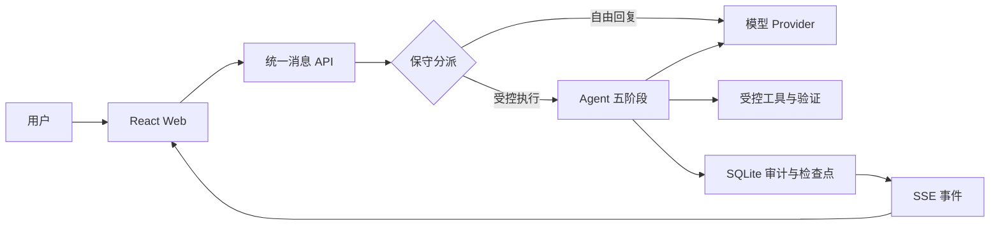

# 御网智元 v0.5.0

御网智元是一个单机自托管、可审计的对话式安全 Agent 工作台。它把用户任务、
模型调用、受控工具、验证结果、预算和报告保存在本地 SQLite 中，适合计算机专业
学生学习“一个 Agent 如何从请求走到可验证结果”。

当前能做：连接 DeepSeek、阿里云百炼/千问、智谱 GLM 或其他 OpenAI 兼容 API；
使用一个统一输入框完成自然语言多轮对话和受控任务；系统只在确实需要计划、工具或
验证时创建内部 Run，随后提供暂停、继续、追加指引、受控工具、验证和报告；刷新后
恢复消息与运行状态。

当前不能做：任意 Shell、未授权公网扫描、自动攻击、多智能体协作、插件市场、
多租户 SaaS。模型输出也不会被直接当作已验证事实。

## 三步启动（Windows）

首次使用请先安装 Docker Desktop。之后可以在项目根目录打开 PowerShell：

```powershell
# 1. 生成本机配置；已有 .env 时绝不覆盖
.\yuwang.ps1 setup

# 2. 只读检查环境
.\yuwang.ps1 doctor

# 3. 启动
.\yuwang.ps1 start
```

打开 <http://localhost:8080>。以后只需记住 `yuwang.ps1`；查看全部命令：

```powershell
.\yuwang.ps1 help
```

不想打开 PowerShell 时，直接双击项目根目录的 `启动御网智元.cmd` 即可。它会执行同一套
配置、Docker、端口和健康检查；如果检测到默认位置的 Docker Desktop 尚未启动，会先尝试
启动并等待引擎就绪。启动成功后自动打开浏览器，失败时保留窗口并显示原因。关闭这个窗口
不会停止服务，停止仍运行 `.\yuwang.ps1 stop`。

> 第一次使用建议继续阅读 [5 分钟快速入门](docs/quickstart.md)。Linux/macOS
> 可使用 `./scripts/first-setup.sh --start`，详见[部署文档](docs/deployment.md)。

## 第一次配置

1. 在本机打开 `.env`，复制 `YUWANG_ADMIN_TOKEN=` 后面的值。不要截图或发送它。
2. Web 设置中心默认进入“新手模式”。依次选择厂商、核对 API 地址、填写 API Key
   和模型，然后保存 Provider（模型服务连接配置）。
3. 点击“连接测试”。这是一次真实模型请求，不是模拟成功。
4. 确认页面显示“Provider 已连接”“默认 Agent 可用”“可以开始对话”。
5. 保存默认聊天模型，关闭设置，创建对话并发送消息。

新手模式和高级模式操作同一份正式配置。高级模式可继续修改超时、重试、费用、
备用 Provider、结构化输出、Agent 预算、上下文、记忆、规划、验证和版本。

连接失败时，页面会区分 API Key 错误、地址或模型错误、请求超时、额度/限流和
结构化输出不兼容。更多处理方法见 [Provider 文档](docs/model-provider.md) 和
[故障排查](docs/troubleshooting.md)。

## 完成第一次消息与自动执行任务

1. 点击“新建对话”，填写可选的对话名称后创建。
2. 在同一个输入框中发送“你好”、解释代码或分析附件，系统直接流式返回自然语言，
   不创建 Run，也不要求成功正则或结构化 JSON。
3. 发送“完成这道授权 CTF 题”“执行任务”或“验证并报告结果”等明确受控执行请求时，
   系统自动创建 Run，并显示简短进度；Provider、任务配置和验证规则由设置中心的默认配置决定。
   证据模式会自动要求候选值绑定成功的受控工具调用，无需在输入框填写正则。
4. 受控任务可在安全检查点暂停和继续；“追加指引”按序排队，应用后会明确显示
   “已应用并重规划”。停止仍表示终止当前 Run，与暂停不同。
5. 结果卡先给简洁结论；计划、工具参数、证据、预算和完整报告默认折叠，可在“任务详情与控制”
   或“运行审计”中查看。普通聊天不会显示空审计面板。

Provider 没有返回 Token 用量时，界面明确显示“厂商未提供”，同时单独说明本地
预算估算，不会把估算伪装成厂商账单。

## 先理解这几个概念

不需要先读完源码才能使用，但下面几个名词会反复出现在页面、API 和文档中：

- **Provider（模型服务）**：保存厂商、API 地址、模型和加密后的 API Key。一次真实连接测试成功后才算就绪。
- **Agent（智能体配置）**：规定模型怎样规划、验证、使用预算和生成结果。它不是另一个模型账号。
- **Thread（对话）**：保存消息、附件和历史运行，刷新页面后仍可继续。
- **Run（运行实例）**：一次具体执行。每次重试都会创建新的 Run，旧记录不会被覆盖。
- **Event（公开事件）**：记录计划、状态、工具、验证和结果，用于进度展示与审计，不包含模型隐藏思维链。
- **Evidence（证据）**：由受控工具产生、可回查的结果。模型自己声称“已完成”不等于验证成功。
- **Report（报告）**：运行结束后生成的 Markdown 和 JSON 摘要，可用于复盘或程序处理。

Web 始终调用统一消息入口。后端以保守规则判断：普通问题、代码解释和附件分析走自由
文本流；明确请求受控执行时才保存用户消息、固化快照并创建 Run。`interaction_mode`
字段仍保留在历史数据和兼容 API 中，但不再是用户需要选择的概念。

## 系统会如何处理我的消息？

- **直接回复**：问候、解释代码、讨论方案、连续追问和允许的文本附件分析，都会流式返回自然语言。
- **受控执行**：明确要求执行任务、调用工具、完成授权 CTF、验证并报告时，自动进入 Task Brief、
  计划、工具、验证和报告流程。
- **停止**：运行期间发送“停止”“停止生成”“停止任务”“取消”或“终止”，会终止当前 Run；
  也可以使用输入框右侧的停止按钮。
- **高级策略**：Provider、备用链、预算、上下文、工具权限、计划和验证策略仍在设置中心配置，
  但不会阻塞日常使用。

## 结果状态怎么看

- **成功**：运行已完成；结果卡还会说明是否经过验证，二者不是同一个概念。
- **失败**：预算、模型、工具或验证明确失败；先阅读失败原因和建议的下一步。
- **已停止**：用户主动停止或系统安全边界终止；已有事件和证据仍会保留。
- **等待用户**：Agent 缺少必要信息；在补充框回答后可从检查点继续，不必重新建任务。

刷新或重启后，工作台从数据库恢复当前 Thread、Run、公开事件和结果卡。若浏览器显示的状态
与服务端不一致，先运行 `status` 和 `doctor`，再查看“运行审计”，不要通过删除数据库来重置。

## 给第一次任务的建议

1. 写清楚目标、允许的范围和预期输出，不要只输入“帮我看看”。
2. 把外部文本和附件视为不可信输入；其中的命令不会自动获得更高权限。
3. 在结果卡中同时检查答案、验证状态、证据和消耗，而不是只看绿色状态。
4. 对重要结论下载报告，并在真实业务系统外再次核对后再采取行动。
5. 如果 Provider 不返回 Token 或费用，接受“厂商未提供”，不要把本地估算当成账单。

项目只执行显式注册的工具。新增工具时必须声明输入模型、风险等级、超时和输出摘要，
并补充失败、越权和审计测试；不要把任意命令执行包装成“通用工具”。

## Docker 与开发模式

日常体验和验收使用默认 Docker 模式：依赖最少、端口固定、前后端版本一致。
需要修改 React 或 FastAPI 时使用 `start -Development`，它会记录本项目进程的 PID、
启动时间和项目根目录，之后 `stop -Development` 只停止通过校验的这些进程。

两种模式不要同时运行。默认端口被占用时，先运行 `status` 判断是否为本项目服务，
再按[故障排查](docs/troubleshooting.md)处理；不要按进程名批量结束 Python 或 Node.js。

## 常用命令

```powershell
.\yuwang.ps1 setup                  # 首次配置
.\yuwang.ps1 start                  # Docker 启动（推荐）
.\yuwang.ps1 start -Build           # 拉取更新后重建镜像
.\yuwang.ps1 start -Development     # 本地 API + Vite 开发模式
.\yuwang.ps1 stop                   # 只停止本项目记录的服务
.\yuwang.ps1 stop -Development      # 只停止已验证的本地开发进程
.\yuwang.ps1 status                 # 地址与就绪状态
.\yuwang.ps1 doctor                 # 只读诊断，不输出密钥
.\yuwang.ps1 check                  # 完整质量检查
```

`status` 会显示 Web、API、数据库、Provider 和默认 Agent。`doctor` 检查
Python、Node.js、npm、Docker、`.env`、端口、依赖、数据目录和健康状态，并给出
中文解决办法。命令兼容 Windows PowerShell 5.1 和新版 PowerShell。

## 系统如何工作



- Web 通过同源 HttpOnly 会话访问 API；写请求还需要内存中的 CSRF 令牌。
- API 先决定消息是自由回复还是受控执行；仅后者会固化任务、Provider 和 Agent 快照并启动 Run。
- Agent 按预算准备、规划、执行、验证、收尾；Provider 只负责结构化模型调用。
- Event（事件）先持久化再通过 SSE 推送。刷新或重启后以数据库为准恢复。
- evidence 模式必须有工具证据并通过确定性规则；模型不能自行宣布成功。

完整链路和每阶段代码位置见 [Agent 循环](docs/agent-loop.md)。

## 代码地图

```text
apps/web/src/
  App.tsx                         页面级状态与动作协调
  hooks/useWorkbenchData.ts       会话选择、刷新恢复、Run/SSE 生命周期
  components/RunSummary.tsx       五阶段与结果卡
  SettingsCenter.tsx              新手/高级设置入口

apps/api/
  main.py                         FastAPI 装配与统一安全边界
  context.py                      单应用依赖、调度、恢复与就绪判断
  routes/                         Thread、Run、设置和报告 API

src/yuwang/
  agent/nodes.py                  规划、动作、验证等单步业务
  agent/runner.py                 LangGraph 连接、运行和恢复
  agent/engine.py                 上下文、模型计量与稳定门面
  agent/finalization.py           报告、助手消息和记忆收尾
  model_providers/providers.py    OpenAI 兼容协议与错误分类
  storage/sqlite.py               Run、事件、检查点和审计
  storage/sqlite_workspace.py     Thread、消息、附件和记忆
  storage/sqlite_settings.py      Provider、预算和 Agent 版本
  tooling/sdk.py                  显式工具注册、校验和执行
```

生产文件尽量保持单一职责并控制在约 400 行。`providers.py` 和 `nodes.py` 接近该
范围，但分别保持一个协议适配器和一组工作流节点，继续拆分反而会增加跳转。

## 30 分钟学习路线

- 0～5 分钟：按三步启动，运行 `.\yuwang.ps1 status`，完成 Web 首次配置。
- 5～10 分钟：发送一个普通问题，再发送一次明确受控执行请求，观察简短进度和最终结果卡。
- 10～15 分钟：打开浏览器开发者工具 Network，找到 `message`、`events/stream`
  和 `audit` 请求。
- 15～20 分钟：阅读 `apps/web/src/App.tsx`、`hooks/useWorkbenchData.ts` 和
  `api.ts`，确认刷新恢复与 SSE 如何连接。
- 20～25 分钟：阅读 `apps/api/routes/runs.py` 与 `apps/api/context.py`，找到 Run
  快照和后台调度入口。
- 25～30 分钟：按 `agent/nodes.py → runner.py → engine.py → finalization.py`
  阅读五阶段，再用测试验证理解。

更完整的代码导读见 [学习指南](docs/learning-guide.md)。

## 本地开发

需要 Python 3.11+、Node.js 20+ 和 npm。首次安装：

```powershell
python -m pip install -r requirements.lock
python -m pip install --no-deps -e .
Push-Location apps/web
npm ci
Pop-Location
.\yuwang.ps1 start -Development
```

开发地址为 Web <http://localhost:5173>、API <http://localhost:8000>、OpenAPI
<http://localhost:8000/api/docs>。开发数据在 `data/development/`，日志在
`data/logs/`，不会和 Docker 数据混用。

需要单独调试时：

```powershell
$env:YUWANG_ADMIN_TOKEN='仅当前进程使用的值'
$env:YUWANG_MASTER_KEY='有效 Fernet 密钥'
uvicorn apps.api.main:app --reload --port 8000

cd apps/web
npm run dev
```

不要把真实密钥写进命令历史；上面的形式仅说明变量名，实际优先使用 `.env` 和
统一启动脚本。

## 调用本地正式 API

[examples/local_api.py](examples/local_api.py) 使用正式管理员会话、Provider、Agent、
Thread、Run、审计和报告接口，不依赖测试替身：

```powershell
python examples/local_api.py
```

脚本会安全提示输入管理员令牌。Provider 尚未真实测试成功时，它会直接给出中文
配置提示，不会伪造结果。

## 测试与质量门禁

```powershell
.\yuwang.ps1 check
```

完整入口运行 Ruff、mypy、pytest、覆盖率、前端 lint/typecheck/unit/build、生产表面
检查、Playwright、Compose 配置和 Windows 启动安全验收。小改动可先执行：

```powershell
.\scripts\check.ps1
```

测试分层、真实 Provider 冒烟和单独命令见 [测试文档](docs/testing.md)。生产源码和
镜像不得包含 `tests/` 中的协议服务或测试替身。

## 数据、安全与部署

- `.env`、`data/`、日志、数据库、缓存和构建产物已由 `.gitignore` 排除。
- Provider API Key 通过管理员接口录入，以 `YUWANG_MASTER_KEY` 加密后存储；公开
  API 只返回 `has_api_key`。
- `stop` 只处理当前 Compose 项目或带 PID、启动时间和项目根校验的开发进程记录。
- `doctor` 是只读诊断；不会创建探针文件、修改配置或停止进程。
- 默认定位是单机自托管。公网部署必须增加 HTTPS、外层身份控制、限流和备份。

- 部署、备份、恢复：[docs/deployment.md](docs/deployment.md)
- 安全边界：[docs/security.md](docs/security.md)
- 升级兼容：[docs/upgrade.md](docs/upgrade.md)

## 文档导航

- [快速入门](docs/quickstart.md)：第一次启动到完成对话。
- [Agent 循环](docs/agent-loop.md)：五阶段与真实代码文件。
- [架构](docs/architecture.md)：依赖方向、状态机和事件协议。
- [模型 Provider](docs/model-provider.md)：预设、错误与结构化输出。
- [Agent 配置](docs/agent-profiles.md)：版本、提示词、规划和验证。
- [上下文与记忆](docs/context-memory.md)：裁剪、完成可信等级和人工补充。
- [设置参考](docs/settings.md)：全部高级字段。
- [测试](docs/testing.md)：质量门禁与浏览器验收。
- [故障排查](docs/troubleshooting.md)：启动、鉴权、模型和恢复问题。
- [扩展开发](docs/extensions.md)：Provider、组件与工具的扩展边界。

## 参与协作

1. 从 `main` 创建 `codex/`、`feat/` 或 `fix/` 分支，不直接提交到 `main`。
2. 保持 API、数据库和历史快照兼容；不要降低覆盖率或删除安全检查。
3. 提交前运行 `.\yuwang.ps1 check`，确认 `git status` 不含密钥和运行产物。
4. 提交信息说明用户可见结果，例如“优化：简化首次配置”。

如果你的修改需要任意 Shell、公网扫描、多智能体、插件市场或多租户，请先作为新
阶段讨论，不要借普通功能提交扩大当前安全边界。
