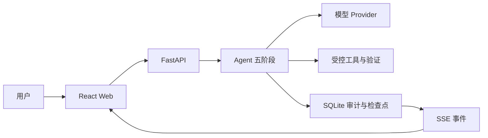

# 御网智元 v0.4.2

御网智元是一个单机自托管、可审计的对话式安全 Agent 工作台。它把用户任务、
模型调用、受控工具、验证结果、预算和报告保存在本地 SQLite 中，适合计算机专业
学生学习“一个 Agent 如何从请求走到可验证结果”。

当前能做：连接 DeepSeek、阿里云百炼/千问、智谱 GLM 或其他 OpenAI 兼容 API；
持续对话；执行显式注册的低风险工具；显示五阶段进度；停止、补充、重试、恢复；
导出 Markdown/JSON 报告。

当前不能做：任意 Shell、未授权公网扫描、自动攻击、多智能体协作、插件市场、
多租户 SaaS。模型输出也不会被直接当作已验证事实。

## 三步启动（Windows）

先安装并启动 Docker Desktop，然后在项目根目录打开 PowerShell：

```powershell
# 1. 生成本机配置；已有 .env 时绝不覆盖
.\yuwang.ps1 setup

# 2. 只读检查环境
.\yuwang.ps1 doctor

# 3. 启动
.\yuwang.ps1 start
```

打开 <http://localhost:8080>。以后只需记住 `yuwang.ps1`；查看全部命令：

```powershell
.\yuwang.ps1 help
```

> 第一次使用建议继续阅读 [5 分钟快速入门](docs/quickstart.md)。Linux/macOS
> 可使用 `./scripts/first-setup.sh --start`，详见[部署文档](docs/deployment.md)。

## 第一次配置

1. 在本机打开 `.env`，复制 `YUWANG_ADMIN_TOKEN=` 后面的值。不要截图或发送它。
2. Web 设置中心默认进入“新手模式”。依次选择厂商、核对 API 地址、填写 API Key
   和模型，然后保存 Provider（模型服务连接配置）。
3. 点击“连接测试”。这是一次真实模型请求，不是模拟成功。
4. 确认页面显示“Provider 已连接”“默认 Agent 可用”“可以开始对话”。
5. 关闭设置，创建任务并发送消息。

新手模式和高级模式操作同一份正式配置。高级模式可继续修改超时、重试、费用、
备用 Provider、结构化输出、Agent 预算、上下文、记忆、规划、验证和版本。

连接失败时，页面会区分 API Key 错误、地址或模型错误、请求超时、额度/限流和
结构化输出不兼容。更多处理方法见 [Provider 文档](docs/model-provider.md) 和
[故障排查](docs/troubleshooting.md)。

## 完成第一个任务

1. 点击“新建任务”，选择默认 Agent（行为配置）和普通模式。
2. 输入目标；证据模式还需填写可确定判断成功的正则表达式。
3. 发送后观察五个阶段：理解任务 → 制定计划 → 执行动作 → 验证结果 → 生成汇报。
4. 结果卡会说明成功、失败、停止或等待用户，展示答案、验证、证据、消耗、原因和
   下一步。技术事件、工具输入摘要和检查点保留在“运行审计”。

Provider 没有返回 Token 用量时，界面明确显示“厂商未提供”，同时单独说明本地
预算估算，不会把估算伪装成厂商账单。

## 常用命令

```powershell
.\yuwang.ps1 setup                  # 首次配置
.\yuwang.ps1 start                  # Docker 启动（推荐）
.\yuwang.ps1 start -Build           # 拉取更新后重建镜像
.\yuwang.ps1 start -Development     # 本地 API + Vite 开发模式
.\yuwang.ps1 stop                   # 只停止本项目记录的服务
.\yuwang.ps1 stop -Development      # 只停止已验证的本地开发进程
.\yuwang.ps1 status                 # 地址与就绪状态
.\yuwang.ps1 doctor                 # 只读诊断，不输出密钥
.\yuwang.ps1 check                  # 完整质量检查
```

`status` 会显示 Web、API、数据库、Provider 和默认 Agent。`doctor` 检查
Python、Node.js、npm、Docker、`.env`、端口、依赖、数据目录和健康状态，并给出
中文解决办法。命令兼容 Windows PowerShell 5.1 和新版 PowerShell。

## 系统如何工作



- Web 通过同源 HttpOnly 会话访问 API；写请求还需要内存中的 CSRF 令牌。
- API 固化任务、Provider 和 Agent 快照后，后台启动一次 Run（运行实例）。
- Agent 按预算准备、规划、执行、验证、收尾；Provider 只负责结构化模型调用。
- Event（事件）先持久化再通过 SSE 推送。刷新或重启后以数据库为准恢复。
- evidence 模式必须有工具证据并通过确定性规则；模型不能自行宣布成功。

完整链路和每阶段代码位置见 [Agent 循环](docs/agent-loop.md)。

## 代码地图

```text
apps/web/src/
  App.tsx                         页面级状态与动作协调
  hooks/useWorkbenchData.ts       会话选择、刷新恢复、Run/SSE 生命周期
  components/RunSummary.tsx       五阶段与结果卡
  SettingsCenter.tsx              新手/高级设置入口

apps/api/
  main.py                         FastAPI 装配与统一安全边界
  context.py                      单应用依赖、调度、恢复与就绪判断
  routes/                         Thread、Run、设置和报告 API

src/yuwang/
  agent/nodes.py                  规划、动作、验证等单步业务
  agent/runner.py                 LangGraph 连接、运行和恢复
  agent/engine.py                 上下文、模型计量与稳定门面
  agent/finalization.py           报告、助手消息和记忆收尾
  model_providers/providers.py    OpenAI 兼容协议与错误分类
  storage/sqlite.py               Run、事件、检查点和审计
  storage/sqlite_workspace.py     Thread、消息、附件和记忆
  storage/sqlite_settings.py      Provider、预算和 Agent 版本
  tooling/sdk.py                  显式工具注册、校验和执行
```

生产文件尽量保持单一职责并控制在约 400 行。`providers.py` 和 `nodes.py` 接近该
范围，但分别保持一个协议适配器和一组工作流节点，继续拆分反而会增加跳转。

## 30 分钟学习路线

- 0～5 分钟：按三步启动，运行 `.\yuwang.ps1 status`，完成 Web 首次配置。
- 5～10 分钟：创建一次对话，观察五阶段进度和最终结果卡。
- 10～15 分钟：打开浏览器开发者工具 Network，找到 `turns`、`events/stream`
  和 `audit` 请求。
- 15～20 分钟：阅读 `apps/web/src/App.tsx`、`hooks/useWorkbenchData.ts` 和
  `api.ts`，确认刷新恢复与 SSE 如何连接。
- 20～25 分钟：阅读 `apps/api/routes/runs.py` 与 `apps/api/context.py`，找到 Run
  快照和后台调度入口。
- 25～30 分钟：按 `agent/nodes.py → runner.py → engine.py → finalization.py`
  阅读五阶段，再用测试验证理解。

更完整的代码导读见 [学习指南](docs/learning-guide.md)。

## 本地开发

需要 Python 3.11+、Node.js 20+ 和 npm。首次安装：

```powershell
python -m pip install -r requirements.lock
python -m pip install --no-deps -e .
Push-Location apps/web
npm ci
Pop-Location
.\yuwang.ps1 start -Development
```

开发地址为 Web <http://localhost:5173>、API <http://localhost:8000>、OpenAPI
<http://localhost:8000/api/docs>。开发数据在 `data/development/`，日志在
`data/logs/`，不会和 Docker 数据混用。

需要单独调试时：

```powershell
$env:YUWANG_ADMIN_TOKEN='仅当前进程使用的值'
$env:YUWANG_MASTER_KEY='有效 Fernet 密钥'
uvicorn apps.api.main:app --reload --port 8000

cd apps/web
npm run dev
```

不要把真实密钥写进命令历史；上面的形式仅说明变量名，实际优先使用 `.env` 和
统一启动脚本。

## 调用本地正式 API

[examples/local_api.py](examples/local_api.py) 使用正式管理员会话、Provider、Agent、
Thread、Run、审计和报告接口，不依赖测试替身：

```powershell
python examples/local_api.py
```

脚本会安全提示输入管理员令牌。Provider 尚未真实测试成功时，它会直接给出中文
配置提示，不会伪造结果。

## 测试与质量门禁

```powershell
.\yuwang.ps1 check
```

完整入口运行 Ruff、mypy、pytest、覆盖率、前端 lint/typecheck/unit/build、生产表面
检查、Playwright、Compose 配置和 Windows 启动安全验收。小改动可先执行：

```powershell
.\scripts\check.ps1
```

测试分层、真实 Provider 冒烟和单独命令见 [测试文档](docs/testing.md)。生产源码和
镜像不得包含 `tests/` 中的协议服务或测试替身。

## 数据、安全与部署

- `.env`、`data/`、日志、数据库、缓存和构建产物已由 `.gitignore` 排除。
- Provider API Key 通过管理员接口录入，以 `YUWANG_MASTER_KEY` 加密后存储；公开
  API 只返回 `has_api_key`。
- `stop` 只处理当前 Compose 项目或带 PID、启动时间和项目根校验的开发进程记录。
- `doctor` 是只读诊断；不会创建探针文件、修改配置或停止进程。
- 默认定位是单机自托管。公网部署必须增加 HTTPS、外层身份控制、限流和备份。

- 部署、备份、恢复：[docs/deployment.md](docs/deployment.md)
- 安全边界：[docs/security.md](docs/security.md)
- 升级兼容：[docs/upgrade.md](docs/upgrade.md)

## 文档导航

- [快速入门](docs/quickstart.md)：第一次启动到完成对话。
- [Agent 循环](docs/agent-loop.md)：五阶段与真实代码文件。
- [架构](docs/architecture.md)：依赖方向、状态机和事件协议。
- [模型 Provider](docs/model-provider.md)：预设、错误与结构化输出。
- [Agent 配置](docs/agent-profiles.md)：版本、提示词、规划和验证。
- [上下文与记忆](docs/context-memory.md)：裁剪、完成可信等级和人工补充。
- [设置参考](docs/settings.md)：全部高级字段。
- [测试](docs/testing.md)：质量门禁与浏览器验收。
- [故障排查](docs/troubleshooting.md)：启动、鉴权、模型和恢复问题。
- [扩展开发](docs/extensions.md)：Provider、组件与工具的扩展边界。

## 参与协作

1. 从 `main` 创建 `codex/`、`feat/` 或 `fix/` 分支，不直接提交到 `main`。
2. 保持 API、数据库和历史快照兼容；不要降低覆盖率或删除安全检查。
3. 提交前运行 `.\yuwang.ps1 check`，确认 `git status` 不含密钥和运行产物。
4. 提交信息说明用户可见结果，例如“优化：简化首次配置”。

如果你的修改需要任意 Shell、公网扫描、多智能体、插件市场或多租户，请先作为新
阶段讨论，不要借普通功能提交扩大当前安全边界。
