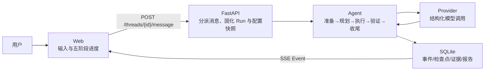

# Agent 五阶段循环

本页描述统一消息入口在内部选择“受控执行”后使用的五阶段循环。普通消息走自由文本链，
直接保存完整用户/助手消息，不创建 Run，也不要求结构化 Action；用户无需手动选择该路径。
已有 Run 时，同一输入框会随状态变成追加指引、补充信息、任务澄清或停止，而不是新开一个
并行 Run。Agent（智能执行器）不会直接把模型文本当成已验证结果。一次受控执行请求先形成
不可变 Run，再经过准备、规划、受控动作、验证和报告收尾。Event（事件）是保存到 SQLite
后再推送到页面的公开进度，不包含隐藏思维链。

## 1. 理解任务

实际节点：`ingest`、`normalize_task`。

- `apps/api/routes/messages.py` 先处理停止、运行中指引、等待补充和等待澄清；只有没有活动
  Run 时才判断消息是否需要受控执行。
- `apps/api/run_interactions.py` 负责补充、澄清和追加指引的请求 ID 幂等、时间线保存、附件
  归属校验与检查点恢复。`apps/api/routes/runs.py` 中的同类接口复用这一用例以保持兼容。
- `apps/api/context.py` 构造不可变 TaskSpec，保存 Provider/Profile 快照并调度后台任务。
- `src/yuwang/agent/nodes.py` 载入任务快照、清理输入边界并发出公开状态事件。
- `src/yuwang/agent/engine.py` 建立上下文锚点和剩余预算，防止恢复时任务漂移。

页面依据 Run、Event 和审计检查点显示阶段，而不是另存一套“前端进度”。

## 2. 制定计划

实际节点：`plan`；直接回答策略会跳过独立规划，但仍保留阶段说明。

- `src/yuwang/agent/components.py` 的 Planner 只接收经过裁剪的安全上下文。
- `src/yuwang/agent/engine.py` 调用 Provider，并记录真实请求数、Token 来源、费用和耗时。
- `src/yuwang/agent/progress.py` 追踪计划变化与重复动作。
- `src/yuwang/model_providers/providers.py` 负责 OpenAI 兼容协议、超时、错误分类和受预算
  约束的重试/备用链；它不能决定任务是否成功。

模型只返回结构化计划和公开摘要，页面不展示隐藏思维链。

## 3. 执行动作

实际节点：`select_action`、`policy_check`、`execute_tool`、`observe`、`replan`。

- `nodes.py` 选择动作，检测连续重复或无进展，并决定执行、重规划或请求用户补充。
- `src/yuwang/policy/engine.py` 对工具、目标、路径和网络权限做确定性检查。
- `src/yuwang/tooling/sdk.py` 只运行显式注册、带 Pydantic 输入输出和超时的工具。
- `src/yuwang/storage/sqlite.py` 保存 ModelCall、ToolCall、观察、事件和检查点。

当前版本不接受任意 Shell，也不允许未授权公网扫描。

## 4. 验证结果

实际节点：`verify`、`complete`。

- advisory（建议）模式：保留“未经外部验证”的明确标识。
- structured（结构化）模式：结果必须通过配置的 JSON Schema；这只说明结构符合约定，不能把模型
  自我声明当作外部证据。
- evidence（证据）模式：只有配置了具体规则时，候选才可关联真实成功工具调用，并通过正则或
  SHA-256 等确定性规则。
- 若没有确定性外部验证条件，Agent 可以交付回答，但 `validation_status` 为 `unverified`，结果
  卡明确显示“未外部验证”。系统不会再补入 `regex: .+`；能匹配无关普通文本的万能正则也会被拒绝。
- `src/yuwang/agent/verification.py` 实现确定性验证；另一次模型调用不能升级可信等级。

验证失败时，工作流按 AgentProfile 重新规划或明确失败，不能假装成功。

## 5. 生成汇报

实际节点：`generate_report`。

- `src/yuwang/agent/finalization.py` 固化完成状态，生成助手消息，保存运行摘要和受限记忆。
- `src/yuwang/reports/generator.py` 从不可变事件和计量生成 Markdown/JSON 报告。
- `src/yuwang/storage/sqlite_workspace.py` 保存 Thread、Message、附件与可删除记忆。
- `apps/web/src/components/RunSummary.tsx` 展示成功、失败、停止、等待用户四种结果卡。

报告收尾失败、用户停止或预算耗尽都会保存明确 Run 状态和原因。

## 刷新、停止与恢复

- `src/yuwang/agent/runner.py` 连接 LangGraph 节点，统一处理运行、失败、停止和恢复。
- 每个安全节点写检查点。服务重启后从下一个安全节点继续，不重放已完成副作用。
- “安全暂停”只登记请求，在下一个安全节点进入 `paused`；“停止”直接终止本次 Run。活动 Run
  中的停止短语由统一消息入口优先处理，停止消息不会被排队为指引。
- 追加指引按序号持久化。Agent 在安全节点应用未消费指引，保留授权与预算边界；应用后由后续
  节点根据新信息决定是否需要重新规划，页面只显示“已在检查点应用”。
- `waiting_input` 和 `waiting_clarification` 的同一输入框提交会保存用户消息、更新检查点并恢复；
  `paused` 时提交的指引只保存，待用户恢复后才消费。附件也可随这些消息提交，但必须满足当前
  对话归属和运行模式边界，并始终视为不可信。
- 结果不确定的非幂等工具不会自动重试，而是安全失败并要求人工复核。
- `apps/web/src/hooks/useWorkbenchData.ts` 用一个 EventSource 接收 SSE；刷新时重新读取
  Thread、Run、Event、Audit 和 Report，数据库才是权威来源。
- SSE 使用递增 sequence 和 Last-Event-ID 补取，不把临时浏览器状态当作事实。

建议结合 `tests/test_dispatch.py`、`tests/test_api_integration.py`、
`tests/test_success_verification.py`、`apps/web/src/components/MessageComposer.test.tsx` 和
`apps/web/src/components/RunSummary.test.tsx` 阅读，以测试确认每一阶段的真实行为。
