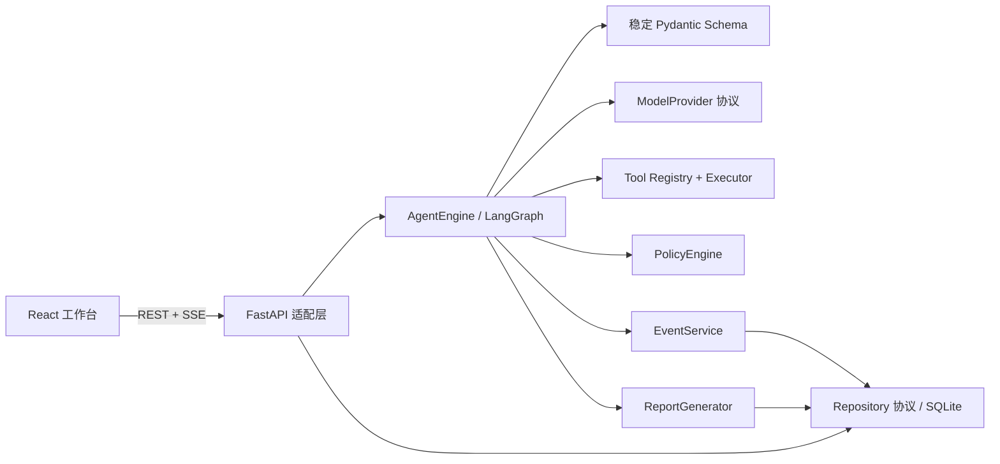
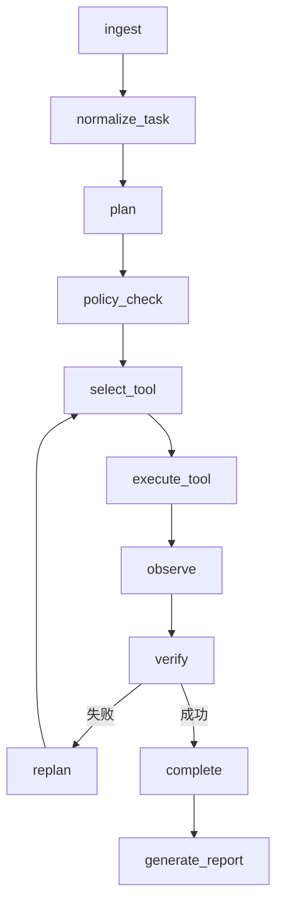

# 架构与依赖方向

御网智元采用模块化单体。核心不导入 FastAPI、SQLite 厂商 SDK、具体模型 SDK 或具体工具实现；启动层负责注入。

## Agent 状态机

每个节点通过 `AgentStateModel` 验证输入输出并写 SQLite 检查点。状态机只理解 `AgentAction`，不解析自然语言控制指令。进程重启时，已完成历史完整读取；未完成运行标为明确的可重试失败，避免不确定地重放副作用。

## 事件协议

`Event` 包含 UUID、Run UUID、严格递增 `sequence`、`schema_version`、类型、UTC 时间、公开摘要和脱敏 payload。数据库唯一约束 `(run_id, sequence)`。SSE 使用 `id: sequence`；浏览器自动发送 `Last-Event-ID`，查询 API 也支持 `after`，因此刷新和断线不会重复。长内容进入 Artifact，事件只存摘要和引用。

同一 Thread 在数据库写入边界只允许一个 `queued/running` Run。预算在每个节点检查步骤、模型/工具调用、Token、总时长和单步超时。
