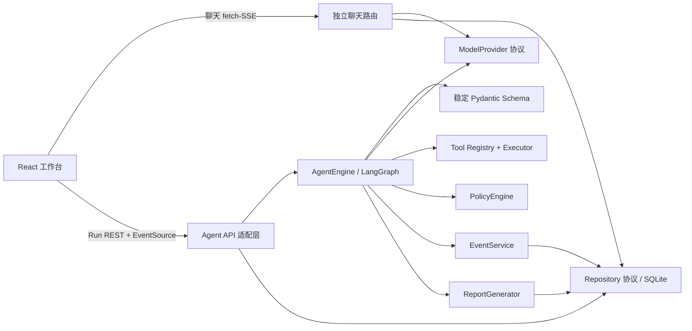
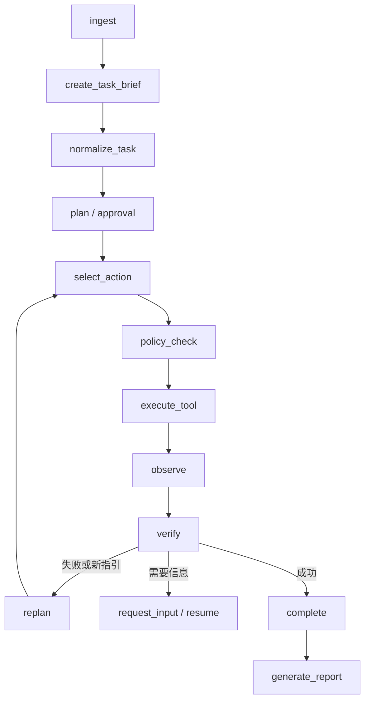

# 架构与依赖方向

面向第一次阅读代码的 Agent 五阶段全链路和文件对应关系见 [Agent 五阶段循环](agent-loop.md)。

御网智元采用模块化单体。核心不导入 FastAPI、SQLite 厂商 SDK、具体模型 SDK 或具体工具实现；启动层负责注入。

API 装配入口 `apps/api/main.py` 只安装中间件和路由；`context.py` 管理仓储、Provider 链、后台任务和恢复生命周期，`routes/` 按会话、线程、运行、报告、Provider 与 Agent 配置拆分。Agent 的 `engine.py` 是稳定运行门面，`state.py` 定义图状态和控制异常，`nodes.py` 实现单步业务节点，`runner.py` 负责 LangGraph 装配、恢复与停止协调，`progress.py` 集中处理循环/无进展判定。

普通聊天与 Agent 任务共享 Provider 配置和消息仓储，但入口、响应契约和生命周期分离：

- `apps/api/routes/chat.py` 返回 `reply_start/text_delta/reply_complete/reply_failed`，不创建 Run。
- `apps/api/routes/runs.py` 固化 TaskSpec、Provider/Profile 快照并调度 LangGraph。
- `apps/web/src/hooks/useChatActions.ts` 使用 fetch-SSE；`useWorkbenchData.ts` 只管理 Agent EventSource 与持久化恢复。
- Thread 的 `interaction_mode=chat|agent` 表示回复方式；`mode=normal|competition` 仅表示 Agent 执行限制。

## Agent 状态机

每个节点通过 `AgentStateModel` 验证输入输出并写 SQLite 检查点。状态机只理解 `AgentAction`，不解析自然语言控制指令。进程重启时，`queued` 和 `running` Run 从持久化检查点恢复；只有结果未知的非幂等调用才会安全失败，避免不确定地重放副作用。

暂停请求只在安全节点消费；非幂等工具结果未知时不会被中断或自动重放。追加指引按
Run 内序号持久化，每条只消费一次；应用时清除旧的循环指纹并进入受 Profile 约束的重规划。

## 事件协议

`Event` 包含 UUID、Run UUID、严格递增 `sequence`、`schema_version`、类型、UTC 时间、公开摘要和脱敏 payload。数据库唯一约束 `(run_id, sequence)`。SSE 使用 `id: sequence`；浏览器自动发送 `Last-Event-ID`，查询 API 也支持 `after`，因此刷新和断线不会重复。长内容进入 Artifact，事件只存摘要和引用。

同一 Thread 在数据库写入边界只允许一个 `queued/running` Run。预算在每个节点检查步骤、模型/工具调用、Token、总时长和单步超时。

## v0.2 决策与恢复语义

运行图为 `ingest → normalize_task → plan → select_action`，动作可进入策略检查/工具执行、重规划、确定性验证或安全失败。模型每次只收到任务快照、受控附件元数据、工具 Schema、公开观察和剩余预算；附件和工具输出均标记为不可信数据。重复动作与连续无进展会触发重规划或终止。

每个节点写入带序号和状态版本的追加式检查点，持久化经过的时间而不是进程单调时钟。进程启动时恢复 `queued/running` Run：已完成调用不重放，结果不确定的非幂等调用直接安全失败，幂等调用可从安全节点重试。Run 同时固化不可变 TaskSpec 与加密 Provider 快照，保证恢复和重试语义一致。

成功只能由 `SuccessVerifier` 确认：模型候选必须绑定成功工具调用 UUID 和 JSON Pointer，来源值必须完全相等，并通过正则或 SHA-256 规则。工具返回成功本身不等于任务成功。

## v0.3 可配置核心

Planner、ActionSelector、ContextBuilder、Memory、Verifier、ReportRenderer 和 WorkflowNode 通过协议与注册表注入，Agent 核心不再导入 SQLite 实现或厂商 SDK。AgentProfile 的声明式节点列表只能组合平台注册节点；安全必需节点不可删除，也不能从 Web 上传可执行代码。

工作流支持规划或直接选择动作、策略检查、工具执行、观察、确定性/结构化验证、重规划、人工补充和报告。TaskSpec 与 AgentProfile 均使用不可变快照。上下文锚点检测任务或配置漂移，计划与动作指纹检测循环和连续无进展。
