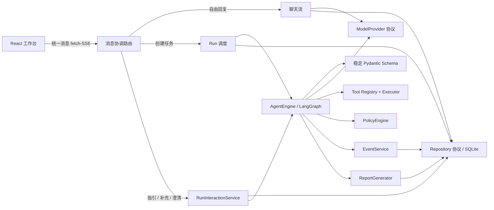
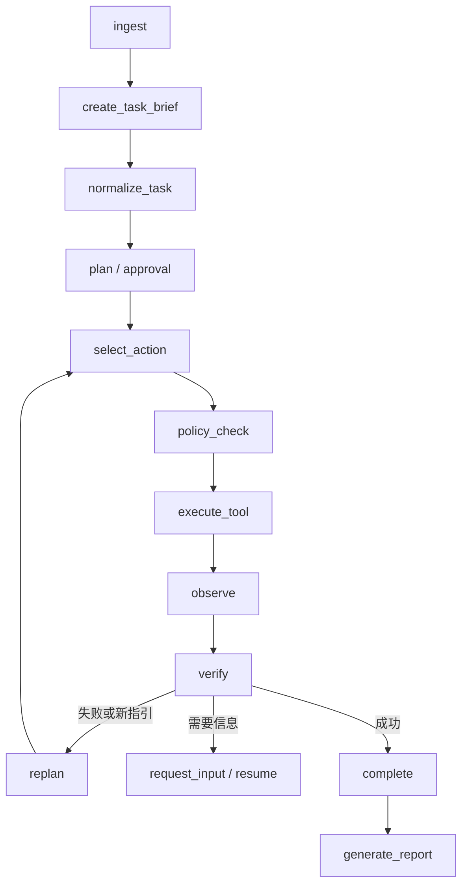

# 架构与依赖方向

面向第一次阅读代码的 Agent 五阶段全链路和文件对应关系见 [Agent 五阶段循环](agent-loop.md)。

御网智元采用模块化单体。核心不导入 FastAPI、SQLite 厂商 SDK、具体模型 SDK 或具体工具实现；启动层负责注入。

API 装配入口 `apps/api/main.py` 只安装中间件和路由；`context.py` 管理仓储、Provider 链、后台任务和恢复生命周期，`routes/` 按会话、线程、运行、报告、Provider 与 Agent 配置拆分。Agent 的 `engine.py` 是稳定运行门面，`state.py` 定义图状态和控制异常，`nodes.py` 实现单步业务节点，`runner.py` 负责 LangGraph 装配、恢复与停止协调，`progress.py` 集中处理循环/无进展判定。

用户层只有一条消息入口，内部仍复用两个稳定生命周期：

- `apps/api/routes/messages.py` 调用 `yuwang.dispatch.route_message()`。先识别活动 Run 的状态：
  停止短语优先，等待补充/澄清时直接提交相应内容，其余活动状态默认追加指引；只有没有
  活动 Run 时才用保守规则判断是否创建受控 Run。带附件的明确分析、检查、提取或验证请求
  同样可创建 Run；“只解释，不要执行”等否定表达优先走自由回复。
- `apps/api/routes/chat.py` 返回 `reply_start/text_delta/reply_complete/reply_failed`，不创建 Run。
- `ApiContext.start_run()` 固化 TaskSpec、Provider/Profile 快照并调度 LangGraph；`routes/runs.py` 的兼容接口也复用它。
- `apps/api/run_interactions.py` 把追加指引、用户补充和任务澄清收敛为同一组持久化、幂等和
  恢复用例；旧的 Run 路由仅为 API 兼容而保留。
- `apps/web/src/hooks/useChatActions.ts` 使用统一 fetch-SSE；`MessageComposer.tsx` 始终保持一个
  可用输入框，`useWorkbenchData.ts` 只管理 Run 的 EventSource 与持久化恢复。
- Thread 的 `interaction_mode=chat|agent` 为历史数据和兼容 API 保留；`mode=normal|competition` 仅表示 Agent 执行限制。

统一输入的公开语义如下。消息和附件必须先通过当前 Thread 的归属和运行模式校验；例如
`competition` 模式的活动 Run 不接受补充提示。前端为消息生成请求 ID，重复提交同一 ID 时，
指引/补充/澄清不会重复写入时间线或重复恢复任务。

| Run 状态 | `POST /threads/{thread_id}/message` 的行为 |
| --- | --- |
| 无活动 Run | 自由回复，或保存用户消息、固化快照并创建 Run。 |
| `queued`、`running`、`waiting_approval` | 保存消息并按 Run 内序号排队为追加指引。 |
| `waiting_input` | 保存补充信息和检查点，从检查点恢复。 |
| `waiting_clarification` | 保存澄清信息和检查点，从检查点恢复。 |
| `paused` | 保存追加指引；恢复后由安全节点消费。 |
| 任意活动状态的停止短语 | 终止当前 Run。 |

## Agent 状态机

每个节点通过 `AgentStateModel` 验证输入输出并写 SQLite 检查点。状态机只理解 `AgentAction`，不解析自然语言控制指令。进程重启时，`queued` 和 `running` Run 从持久化检查点恢复；只有结果未知的非幂等调用才会安全失败，避免不确定地重放副作用。

暂停请求只在安全节点消费；非幂等工具结果未知时不会被中断或自动重放。追加指引按
Run 内序号持久化，每条只消费一次；应用时清除过期的循环指纹，使后续节点能根据新信息
决定继续执行或重新规划。页面只能显示“已在检查点应用”，不能把每条指引都表述为已重规划。

## 事件协议

`Event` 包含 UUID、Run UUID、严格递增 `sequence`、`schema_version`、类型、UTC 时间、公开摘要和脱敏 payload。数据库唯一约束 `(run_id, sequence)`。SSE 使用 `id: sequence`；浏览器自动发送 `Last-Event-ID`，查询 API 也支持 `after`，因此刷新和断线不会重复。长内容进入 Artifact，事件只存摘要和引用。

同一 Thread 在数据库写入边界只允许一个 `queued/running` Run。预算在每个节点检查步骤、模型/工具调用、Token、总时长和单步超时。

## v0.2 决策与恢复语义

运行图为 `ingest → normalize_task → plan → select_action`，动作可进入策略检查/工具执行、重规划、确定性验证或安全失败。模型每次只收到任务快照、受控附件元数据、工具 Schema、公开观察和剩余预算；附件和工具输出均标记为不可信数据。重复动作与连续无进展会触发重规划或终止。

每个节点写入带序号和状态版本的追加式检查点，持久化经过的时间而不是进程单调时钟。进程启动时恢复 `queued/running` Run：已完成调用不重放，结果不确定的非幂等调用直接安全失败，幂等调用可从安全节点重试。Run 同时固化不可变 TaskSpec 与加密 Provider 快照，保证恢复和重试语义一致。

完成状态和外部验证状态分开保存。没有配置确定性规则时，Agent 可以结束并保留结论，但
`validation_status` 必须是 `unverified`，页面显示“未外部验证”。`SuccessVerifier` 只有在
模型候选绑定成功工具调用 UUID 与 JSON Pointer、来源值完全相等且通过具体的正则或 SHA-256
规则时，才标记为 `validated`。工具返回成功、模型自称成功和普通非空文本本身都不等于任务
成功；`.+`、`.*` 等能匹配无关普通文本的万能正则在新配置中被拒绝，历史快照中遇到时也不能
升级为成功。

## v0.3 可配置核心

Planner、ActionSelector、ContextBuilder、Memory、Verifier、ReportRenderer 和 WorkflowNode 通过协议与注册表注入，Agent 核心不再导入 SQLite 实现或厂商 SDK。AgentProfile 的声明式节点列表只能组合平台注册节点；安全必需节点不可删除，也不能从 Web 上传可执行代码。

工作流支持规划或直接选择动作、策略检查、工具执行、观察、确定性/结构化验证、重规划、人工补充和报告。TaskSpec 与 AgentProfile 均使用不可变快照。证据规则随 AgentProfile
版本保存，统一输入和模型输出都不能临时降低验证标准。上下文锚点检测任务或配置漂移，计划与动作指纹检测循环和连续无进展。
