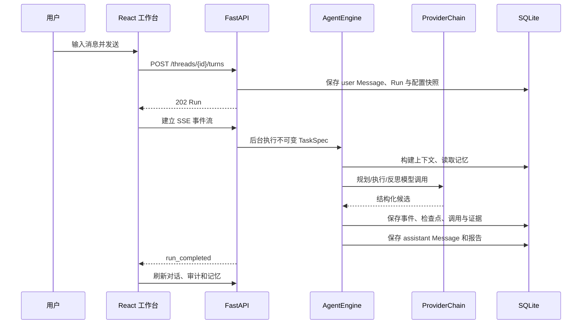

# v0.4 代码阅读与学习指南

本文面向第一次接触御网智元的开发者。建议先跑通一次对话，再按“浏览器 → API → Agent → Provider → 存储”的方向阅读；这样每个抽象都能对应到界面中的真实行为。

## 一条消息怎样完成

关键入口如下：

1. `apps/web/src/App.tsx` 协调页面状态，`api.ts` 统一 Cookie、CSRF 和错误处理。
2. `apps/api/main.py` 的 `turn` 接口把“保存消息”和“启动运行”合成一个原子用例，并立即返回可订阅的 Run。
3. `src/yuwang/agent/engine.py` 是状态机；它只依赖 `AgentRepository`、Provider、工具注册表和显式组件。
4. `src/yuwang/model_providers/providers.py` 负责协议适配、错误分类、重试与备用模型，不能决定任务成功。
5. `src/yuwang/storage/sqlite.py` 保存运行快照和事件。页面刷新或进程重启后，恢复逻辑以持久化状态为准，而不是以内存为准。

## 核心数据字典

| 名称 | 含义 | 生命周期与约束 |
|---|---|---|
| Thread | 一段可持续对话 | 绑定创建时的 AgentProfile 版本；可重命名、归档或安全删除 |
| Message | 用户或助手的自然语言消息 | 按时间进入上下文；附件只保存 ID 引用 |
| AgentProfileVersion | Agent 行为配置快照 | 只增版本，不原地改历史；规划、上下文、记忆、验证和干预策略都在这里 |
| TaskSpec | 某次运行的不可变任务 | 重试复用原始 TaskSpec，避免界面当前值污染历史 |
| Run | 一次执行实例 | 只允许领域模型定义的状态迁移；保存 Provider/Profile 快照引用 |
| Event | 面向人和 SSE 的有序事实 | 每个 Run 内 sequence 连续，可用 Last-Event-ID 断点续传 |
| Checkpoint | Agent 图状态快照 | 进程重启后从安全节点恢复，不重放已完成副作用 |
| ModelCall / ToolCall | 模型与工具审计 | 记录耗时、用量、输入摘要、状态和错误分类 |
| EvidenceRecord | 可验证证据 | 证据模式下必须与候选答案绑定并通过确定性规则 |
| MemoryRecord | 跨轮重要事实或摘要 | 可逐条禁用/删除；数量受 Profile 策略限制 |
| ProviderConfig | 加密模型连接配置 | API Key 仅存密文；连接测试状态参与生产就绪判断 |

## 为什么这样选技术

- FastAPI + Pydantic：把 HTTP 输入校验和领域模型边界写成可检查契约，OpenAPI 只是副产物。
- LangGraph：运行天然是有分支、可暂停、可恢复的状态机；显式节点比隐藏在长循环中的控制流更易审计。
- SQLite：单用户工作台不需要外部数据库即可获得事务、索引和可靠持久化；Repository 协议保留替换空间。
- React + TypeScript：界面状态多且与后端契约紧密，静态类型能尽早发现字段漂移。
- SSE：Agent 事件主要是服务端单向推送，SSE 比 WebSocket 更轻，并原生支持事件游标重连。
- Docker Compose：把 Web、API、数据卷和健康检查变成一条可复现部署路径。

## 四种最小扩展

### 新 Provider

若服务兼容 OpenAI 协议，优先在 `PROVIDER_PRESETS` 增加预设和结构化能力描述，不复制 HTTP 客户端。只有协议不同才实现新的 Provider，并保持 `complete()`、`test_connection()`、错误分类和用量字段一致。

### 新规划器

实现 `Planner` 协议，输入只能来自 `ContextBuildResult` 和 Profile，输出 `AgentPlan`。不要直接访问 FastAPI、SQLite 或浏览器状态；然后在 `AgentComponents` 组合根注入，并补一个能证明配置真正改变计划的测试。

### 新验证器

实现 `CompletionVerifier`，返回明确的通过/失败理由和证据等级。验证器必须是确定性的：不要让另一次模型调用把“看起来正确”升级成“已验证”。

### 未来的新工具

继承 `BaseTool`，声明 Pydantic 输入、风险等级、超时和输出上限，再在显式注册表注册。工具不得绕过 `PolicyEngine`，不得接收任意 Shell 文本，也不得把密钥或完整敏感输入写入事件。

## 常见答辩问答

**为什么说配置真实生效？** 每次 Run 保存 AgentProfile 与 Provider 快照；审计接口展示实际采用的规划策略、工作流、上下文/记忆/干预策略和预算，测试也分别断言行为差异。

**模型为什么不能自行宣告成功？** 模型输出是不可信候选。结构化模式先过 Schema，证据模式还要有外部证据并通过正则等确定性规则。

**如何避免重试造成重复副作用？** 检查点记录已完成节点和观察；恢复从安全边界继续。工具调用有独立审计 ID，恢复逻辑不会把内存状态当作事实。

**API Key 安全在哪里？** 浏览器只把 Key 发送到受 CSRF 保护的管理员接口；服务端用主密钥加密后存库，公开视图只有 `has_api_key`。日志、导出和错误响应都不返回明文。

**为什么整个工作台都要登录？** 对话、附件、报告和审计同样包含敏感信息，不应只保护设置页。统一 HttpOnly、SameSite 会话覆盖 `/api/v1`，写请求还必须提交内存中的 CSRF 令牌。

**上下文太长怎么办？** ContextBuilder 按独立开关选择最近消息、线程摘要、运行摘要和记忆；超过窗口时生成可追踪摘要，并在事件中记录裁剪前后数量。

**怎样证明可以生产部署？** 就绪探针同时检查数据库、主密钥、管理员令牌，以及默认 Agent 能解析到已启用且真实测试成功的 Provider；CI、Docker 冒烟、备份恢复和浏览器 E2E 构成分层证据。
