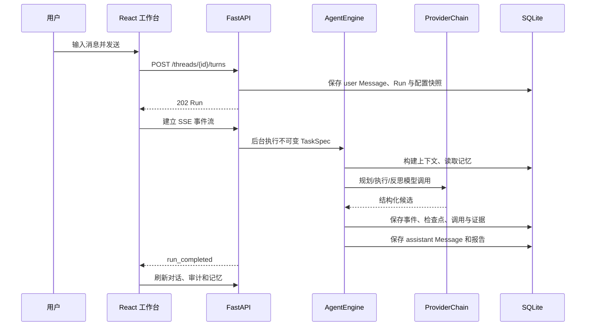

# v0.4.2 代码阅读与学习指南

本文面向第一次接触御网智元的开发者。建议先跑通一次对话，再按“浏览器 → API → Agent → Provider → 存储”的方向阅读；这样每个抽象都能对应到界面中的真实行为。

## 新成员先做什么

第一次接触项目时，不建议从最长的状态机或 SQLite 文件开始。按下面顺序大约一小时即可建立全局认识：

1. 按 [README](../README.md#快速启动) 启动系统，完成 Provider 和默认 Agent 配置。
2. 创建一次普通对话，同时打开浏览器开发者工具的 Network 面板，观察 `turn` 请求和 `events/stream`。
3. 阅读 `apps/web/src/types.ts` 和 `apps/web/src/api.ts`，先认识前后端共同使用的数据形状。
4. 阅读 `apps/web/src/App.tsx` 与 `hooks/useWorkbenchData.ts`，再看 `MessageComposer.tsx`、`RunSummary.tsx` 和 `SettingsCenter.tsx`。
5. 沿 `apps/api/routes/runs.py` 进入 `apps/api/context.py`，理解 HTTP 层如何调度后台运行。
6. 按 `agent/state.py → nodes.py → runner.py → engine.py` 阅读 Agent。
7. 最后阅读 Provider、SQLite 和测试，用测试确认自己对行为的理解。

遇到不理解的类型时先回到 `domain/models.py`；遇到“不知道谁创建这个对象”时用 `rg "类名或函数名"` 找组合入口。

## 一条消息的全链路

关键入口如下：

1. `apps/web/src/App.tsx` 只协调共享状态与网络动作；`components/` 分别承载任务导航、对话/审计、消息输入、Provider 和 Agent 配置，`api.ts` 统一 Cookie、CSRF 和错误处理。
2. `apps/api/main.py` 只装配应用；`context.py` 建立仓储、服务与恢复生命周期，`routes/runs.py` 的 `turn` 接口把“保存消息”和“启动运行”合成一个原子用例，并立即返回可订阅的 Run。
3. `src/yuwang/agent/engine.py` 是稳定运行门面；`nodes.py` 放单步业务节点，`runner.py` 装配 LangGraph 并协调运行/恢复，`finalization.py` 处理报告和记忆收尾，`state.py` 定义可持久化图状态。
4. `src/yuwang/model_providers/providers.py` 负责协议适配、错误分类、重试与备用模型，不能决定任务成功。
5. `src/yuwang/storage/sqlite.py` 保存运行快照和事件，`sqlite_workspace.py` 保存会话数据，`sqlite_settings.py` 保存可管理配置。页面刷新或进程重启后以持久化状态为准。

## 前端一次消息如何到达后端

发送入口在 `MessageComposer.tsx`，但它只收集文本、附件、Provider 和验证规则。真正的共享状态与网络动作在 `App.tsx`：

1. `sendAndRun()` 检查当前 Thread、输入内容和运行状态，阻止同一 Thread 重复启动活动 Run。
2. `api.turn()` 调用 `POST /api/v1/threads/{thread_id}/turns`。`api.ts` 的通用 `request()` 自动携带同源 Cookie、写请求 CSRF、JSON 头和统一错误解析。
3. `routes/runs.py` 先调用 `save_user_message()` 校验附件归属和竞赛模式，再固化 `TaskSpec`、AgentProfile 与 Provider 快照，保存 `Run` 后返回 202。
4. API 使用 `ApiContext.schedule()` 启动后台协程。HTTP 请求不用等待模型完成，因此页面可以马上订阅进度。
5. 前端拿到 Run 后由 `useWorkbenchData.connect()` 建立 EventSource，并在结束事件到达后重新读取 Thread 详情、审计、记忆和报告。

扩展新的发送参数时，需要同时修改 `types.ts`、`api.ts`、`apps/api/schemas.py` 和对应路由测试；不要在组件里手写第二套 fetch。

## Agent 如何运行

`AgentEngine` 是调用方看到的稳定门面，`AgentRunCoordinator` 负责 LangGraph 装配，`WorkflowNodes` 负责每一步业务。一次运行大致经过：

1. `ingest / normalize_task`：载入不可变 TaskSpec，建立受预算约束的初始状态。
2. `plan / select_action`：ContextBuilder 组合安全层、对话、记忆、附件元数据和剩余预算；Provider 只返回结构化动作。
3. `policy_check`：PolicyEngine 根据工具声明、授权目标、路径和网络白名单做确定性判断。
4. `execute_tool / observe`：ToolExecutor 只执行显式注册工具，结果经过 Schema 校验后进入观察和审计。
5. `verify / replan / request_input`：按 advisory、structured 或 evidence 模式完成验证；失败时重规划，缺信息时按 Profile 等待或失败。
6. `generate_report`：由 `finalization.py` 保存助手消息、Markdown/JSON 报告、最终事件和运行摘要。

每个安全节点都会写入 `AgentStateModel` 检查点。停止、预算超限、模型非法输出和不安全恢复会转成明确状态，而不是让后台异常悄悄消失。

修改流程时先判断职责属于哪一层：字段和状态约束放 `state.py`/领域模型，单步行为放 `nodes.py`，节点连接和恢复放 `runner.py`，模型/工具计量等跨节点能力放 `engine.py`。

## 进度如何推送到页面

进度不是临时日志，而是持久化 `Event`：

1. Agent 调用 `EventService.emit()`，服务先对摘要和 payload 递归脱敏。
2. `SQLiteRepository.create_event()` 在事务中分配 Run 内严格递增的 `sequence`。
3. `GET /runs/{run_id}/events/stream` 从 `after` 或 `Last-Event-ID` 后读取事件，按 SSE `id + data` 格式发送；空闲时只发 keep-alive。
4. `useWorkbenchData.connect()` 使用一个 EventSource 处理所有领域事件。断线时浏览器自动带上最后事件 ID，结束后前端重新读取持久化详情。
5. 页面刷新不依赖旧 EventSource：先读取 Thread 和历史事件，再连接仍活跃的 Run。

新增 Event 类型时更新领域枚举和产生事件的位置即可。SSE 保持默认 `message` 通道，领域类型放在 JSON 内，这样旧前端不会因新 SSE 事件名直接失效。

## 配置如何保存

Provider 和 Agent 配置都通过管理员会话写入，但安全语义不同：

- 登录接口验证 `YUWANG_ADMIN_TOKEN` 后创建短生命周期服务端会话；浏览器只持有 HttpOnly Cookie 和内存中的 CSRF，不持久化管理员令牌。
- Provider API Key 只在创建或轮换时出现。`SettingsService` 校验 URL 和结构化模式，再由 `SecretCipher` 加密后写入 SQLite；公开视图只有 `has_api_key`。
- Provider 连接测试会真实请求已保存配置，结果写回 `connection_status`，并参与 readiness 判断。
- AgentProfile 每次编辑、回滚、设默认都会追加版本。Thread 绑定明确版本，Run 再保存完整快照，历史不会被新配置改写。
- 前端 `ProviderSettings` 和 `AgentProfileCenter` 只协调远端操作；`provider/` 与 `agent-profile/` 子目录分别放列表、表单和纯转换规则。

需要新增配置字段时，应同步更新 Pydantic 模型、SQLite 兼容默认值、TypeScript 类型、表单、导入导出 Schema 和契约测试。

## 核心数据字典

| 名称 | 含义 | 生命周期与约束 |
|---|---|---|
| Thread | 一段可持续对话 | 绑定创建时的 AgentProfile 版本；可重命名、归档或安全删除 |
| Message | 用户或助手的自然语言消息 | 按时间进入上下文；附件只保存 ID 引用 |
| AgentProfileVersion | Agent 行为配置快照 | 只增版本，不原地改历史；规划、上下文、记忆、验证和干预策略都在这里 |
| TaskSpec | 某次运行的不可变任务 | 重试复用原始 TaskSpec，避免界面当前值污染历史 |
| Run | 一次执行实例 | 只允许领域模型定义的状态迁移；保存 Provider/Profile 快照引用 |
| Event | 面向人和 SSE 的有序事实 | 每个 Run 内 sequence 连续，可用 Last-Event-ID 断点续传 |
| Checkpoint | Agent 图状态快照 | 进程重启后从安全节点恢复，不重放已完成副作用 |
| ModelCall / ToolCall | 模型与工具审计 | 记录耗时、用量、输入摘要、状态和错误分类 |
| EvidenceRecord | 可验证证据 | 证据模式下必须与候选答案绑定并通过确定性规则 |
| MemoryRecord | 跨轮重要事实或摘要 | 可逐条禁用/删除；数量受 Profile 策略限制 |
| ProviderConfig | 加密模型连接配置 | API Key 仅存密文；连接测试状态参与生产就绪判断 |

## 为什么这样选技术

- FastAPI + Pydantic：把 HTTP 输入校验和领域模型边界写成可检查契约，OpenAPI 只是副产物。
- LangGraph：运行天然是有分支、可暂停、可恢复的状态机；显式节点比隐藏在长循环中的控制流更易审计。
- SQLite：单用户工作台不需要外部数据库即可获得事务、索引和可靠持久化；Repository 协议保留替换空间。
- React + TypeScript：界面状态多且与后端契约紧密，静态类型能尽早发现字段漂移。
- SSE：Agent 事件主要是服务端单向推送，SSE 比 WebSocket 更轻，并原生支持事件游标重连。
- Docker Compose：把 Web、API、数据卷和健康检查变成一条可复现部署路径。

## 深入阅读顺序

1. 前端状态：`types.ts → api.ts → App.tsx → components/`。
2. HTTP 边界：`schemas.py → routes/runs.py → context.py`。
3. Agent 核心：`domain/models.py → agent/state.py → nodes.py → runner.py → engine.py → finalization.py`。
4. 可替换能力：`agent/components.py → model_providers/ → tooling/ → policy/`。
5. 持久化与恢复：`agent/repository.py → storage/sqlite*.py → events/ → reports/`。
6. 行为证据：后端单元/集成测试 → 前端组件测试 → Playwright 全流程。

## 常见扩展应该改哪里

### 新页面或设置区

先在 `types.ts` 补公开契约，在 `api.ts` 增加一个命名清楚的请求函数，再创建只负责一个页面区域的组件。只有多个区域共享的状态才提升到 `App.tsx` 或 `SettingsCenter.tsx`；表单内部状态留在表单协调器。后端新增路由时沿用 `create_*_router` 工厂，并在 `main.py` 统一挂载。

### 新 Provider

若服务兼容 OpenAI 协议，优先在 `PROVIDER_PRESETS` 增加预设和结构化能力描述，不复制 HTTP 客户端。只有协议不同才实现新的 `ModelProvider`，并保持 `generate_structured()`、`test_connection()`、错误分类和用量字段一致。真实密钥必须仍由设置服务解密，不能加入前端或日志。

### 新 Agent 策略或规划器

实现 `Planner` 或对应组件协议，输入只能来自 `ContextBuildResult` 和 Profile，输出 `AgentPlan`。不要直接访问 FastAPI、SQLite 或浏览器状态；然后在 `AgentComponents` 组合根注入，并补一个能证明配置真正改变计划的测试。若新增用户可选值，还要同步 Pydantic Literal、TypeScript 联合类型、表单和 Run 审计。

### 新验证器

实现 `CompletionVerifier`，返回明确的通过/失败理由和证据等级。验证器必须是确定性的：不要让另一次模型调用把“看起来正确”升级成“已验证”。

### 未来的新工具

继承 `ToolPlugin`，声明 Pydantic 输入输出、风险等级、超时和输出上限，再在显式注册表注册。工具不得绕过 `PolicyEngine`，不得接收任意 Shell 文本，也不得把密钥或完整敏感输入写入事件。

## 常见答辩问答

**为什么说配置真实生效？** 每次 Run 保存 AgentProfile 与 Provider 快照；审计接口展示实际采用的规划策略、工作流、上下文/记忆/干预策略和预算，测试也分别断言行为差异。

**模型为什么不能自行宣告成功？** 模型输出是不可信候选。结构化模式先过 Schema，证据模式还要有外部证据并通过正则等确定性规则。

**如何避免重试造成重复副作用？** 检查点记录已完成节点和观察；恢复从安全边界继续。工具调用有独立审计 ID，恢复逻辑不会把内存状态当作事实。

**API Key 安全在哪里？** 浏览器只把 Key 发送到受 CSRF 保护的管理员接口；服务端用主密钥加密后存库，公开视图只有 `has_api_key`。日志、导出和错误响应都不返回明文。

**为什么整个工作台都要登录？** 对话、附件、报告和审计同样包含敏感信息，不应只保护设置页。统一 HttpOnly、SameSite 会话覆盖 `/api/v1`，写请求还必须提交内存中的 CSRF 令牌。

**上下文太长怎么办？** ContextBuilder 按独立开关选择最近消息、线程摘要、运行摘要和记忆；超过窗口时生成可追踪摘要，并在事件中记录裁剪前后数量。

**怎样证明可以生产部署？** 就绪探针同时检查数据库、主密钥、管理员令牌，以及默认 Agent 能解析到已启用且真实测试成功的 Provider；CI、Docker 冒烟、备份恢复和浏览器 E2E 构成分层证据。
